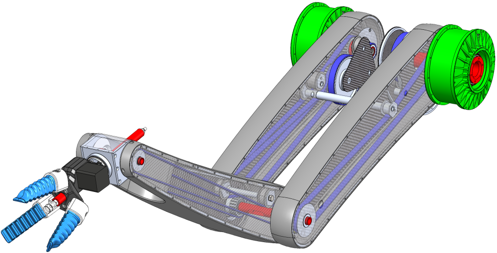

# BeltManipulator.jl
<p align="center">
    
</p>

**This package is accompanying code for:**
C. Stoeffler, J. Janzen, A. del Rio and H. Peters, Design Analysis of a Novel Belt-Driven Manipulator for Fast Movements, IEEE 20th International Conference on Automation Science and Engineering (CASE 2024), submitted March 2024

## Installing julia and installing package
If this is your first contact with Julia, don't be afraid, it goes smooth and can be fast.
* Visit https://julialang.org/downloads/ and download an appropriate version or the *Juliaup* installer
* Start julia
* The repo can be directly added by `Pkg.add(BeltManipulator)` or opening the package manager with `]` (shell promt changes) and `add BeltManipulator`.
* Alternatively: 
    * Download the repo, e.g. via `git clone git@github.com:dfki-ric-underactuated-lab/BeltManipulator` (ssh key required)
    * Open the package manager with `]` (shell promt changes) and run `dev --local RELATIVE_PATH_TO/BeltManipulator`. The package is now locally available.
      
## Using the package
The package can now be loaded in a Julia session and an URDF can be parsed by RigidBodyDynamics.jl. First, a mechanism is build with actuation in joint-space (diagonal structure matrix)
```jl
using BeltManipulator

urdf_path = abspath(joinpath(@__DIR__, "../", "urdf/shivaa_manipulator_local_copy.urdf"))

manipulator = RBDMechanism(urdf_path, S = diagm(ones(4)));
```

This creates a MeshCat server for the visualization of the manipulator in its initial configuration
```jl
[ Info: Listening on: 127.0.0.1:8704, thread id: 1
┌ Info: MeshCat server started. You can open the visualizer by visiting the following URL in your browser:
└ http://127.0.0.1:8700

julia> 
```

We can hand this over to a specific model type on which the iLQR runs
```jl
model_js = ODEModel(4, manipulator);
```

Then the time-step size, final time and boundary positions for the problem are formulated
```jl
# time-step and final time
h = 0.001
tf = 0.8

# start- and end-position
q0 = [0, 1.2π/2, 0, 0]
qf = [-π, -π/2, -π/2, 0]

# checking pose in visualizer
MeshCatMechanisms.set_configuration!(manipulator.mvis, qf)
```

An initial trajectory (initial guess - here all zeros) is created, the iLQR-parameters specified and the iLQR executed. This may take some time, specifically in the first run (just-in-time compilation)
```jl

trj_joptimal_js = Trajectory(model_js, h, tf);

op_js = iLQRParameters(
    x0 = [q0; [0, 0, 0, 0]], 
    xf = [qf; [0, 0, 0, 0]], 
    model = model_js, 
    times = trj_joptimal_js.times, 
    Q = diagm([1e-1*ones(4); 1e-1*ones(4)]), 
    R = diagm([1e-1, 1e-1, 1e-1, 5e2]), 
    Qf = diagm([[6e4, 3e4, 2e4, 1e3]; 1e4ones(4)]), 
    tol = 1e-3,
    reg_limit = 50,
    dβ = 1000.,
    a_red = 0.5,
    regularization = :state,
    second_order = false,
    i_max = 200
);

iLQR!(trj_joptimal_js, model_js, op_js)
```

With the same boundary conditions, the problem can be computed with the actuation-space mapping - here changing the weights to reach the desired states
```jl
rj_aoptimal_as = Trajectory(model_as, h, tf);

op_as = iLQRParameters(
    x0 = [q0; [0, 0, 0, 0]], 
    xf = [qf; [0, 0, 0, 0]], 
    model = model_as, 
    times = trj_aoptimal_as.times,  
    Q = diagm([1e-1*ones(4); 1e-1*ones(4)]), 
    R = diagm([1e1, 1e1, 1e1, 1e1]), 
    Qf = diagm([[3e5, 4e4, 3e4, 1e3]; 1e4ones(4)]),
    tol = 1e-3,
    reg_limit = 50,
    dβ = 1000.,
    a_red = 0.5,
    regularization = :state,
    second_order = false,
    i_max = 200
);

iLQR!(trj_aoptimal_as, model_as, op_as)
```

The trajectories can be plotted and animated. Note that the state-plots are both in joint-space here.
```jl
# joint-space optimal
plot_trajectory(trj_joptimal_js)
animate_mechanism!(arm_js, trj_joptimal_js)

# actuation-space optimal
plot_trajectory(trj_aoptimal_as)
animate_mechanism!(arm_as, trj_aoptimal_as)
```

Finally, reference trajectories are created and states and controls are mapped into the respective spaces to compare power in the spaces.
```jl
# mapping states of the actuation-space optimal trajectory in actuation space
joint2act_map!(trj_aoptimal_as, arm_as, states = true, torque = false);

# creating naive trajectories in both spaces
trj_naive_js = Trajectory(model_js, h, tf);
naive_trajectory!(trj_naive_js, arm_js, op_js);
trj_naive_as = deepcopy(trj_naive_js);
joint2act_map!(trj_naive_as, arm_as, states = true, torque = true);

# creating comparative trajectories and map them into the respective spaces
trj_joptimal_as = deepcopy(trj_joptimal_js);
joint2act_map!(trj_joptimal_as, arm_as, states = true, torque = true);
trj_aoptimal_js = deepcopy(trj_aoptimal_as);
act2joint_map!(trj_aoptimal_js, arm_as, states = true, torque = true);

# comparing everything
BeltManipulator.power_comparison([
    (trj_naive_js, trj_naive_as),
    (trj_joptimal_js, trj_joptimal_as),
    (trj_aoptimal_js, trj_aoptimal_as)], interactive = true)
```

### Running as one script
The above functions can all be run from the shell that stores the power comparison plot as `power_comparison.png`
```
julia <path_to_BeltManipulator/src/example.jl>
```
However, due to just-in-time compilation and rebuilding of model variables, it is much faster to alter optimization parameters (e.g. weights) in one interactive Julia kernel like above.